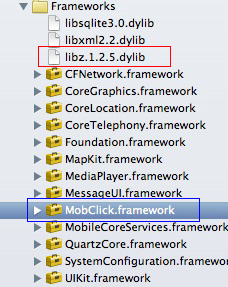

MobClickSDK
===========

这是一个将友盟SDK打包成framework的Shell脚本。

友盟统计网站 <a href="http://www.umeng.com" target="_balnk">http://www.umeng.com</a>

当前打包版本为2.2.0

===========

如何使用

1)使用终端cd到项目根目录

2)执行 ./makeFramework.sh

3)framework文件将会生成在build下

===========

生成的.framework文件如何使用

1)如上图,将MobClick.framework引入到项目中

2)并添加libz.dylib(至于选什么版本的libz,这个可以随意)

3)在需要使用统计代码的文件上引用友盟SDK的头文件,引用代码如下

#import <MobClick/MobClick.h>

